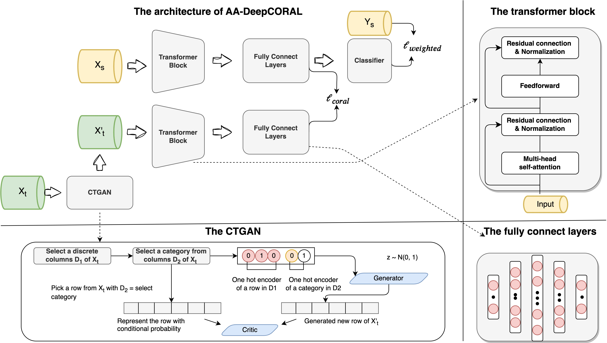

# AA-DeepCORAL
## Architecture
Code for the Paper "AA-DeepCORAL: Attention Augmented Deep CORAL for Supply Chain Credit Assessment Cold Start" 



The proposed AA-DeepCORAL can be found in the model-folder under: 

**>>>IMPORTANT<<<**

The original Code from the paper can be found in this branch: https://github.com/JieJieNiu/AA-Deep-coral/tree/main/AA-DeepCoral

Also we provide the code of baseline models MMD and Deep CORAL:https://github.com/JieJieNiu/AA-Deep-coral/tree/main/Descripency
CADA and DANN: https://github.com/JieJieNiu/AA-Deep-coral/tree/main/Adversarial


The trained model canbe download in this branch, you can load model-best.pt and use it directly, also the baseline models of CADA, DANN, MMD and DeepCORAL can be download here: 
https://github.com/JieJieNiu/AA-Deep-coral

The current master branch has since upgraded packages and was refactored. Since the exact package-versions differ the experiments may not be 100% reproducible.

If you have problems running the code, feel free to open an issue here on Github.

---

## Installing dependencies
In any case a [requirements.txt](requirements.txt) is also added from the poetry export.
```
pip install -r requirements.txt
```

Basically, only the following requirements are needed:
```
numpy==1.20.3
opencv_python_headless==4.6.0.66
pandas==1.3.4
scikit_image==0.18.3
scikit_learn==1.2.0
scipy==1.7.1
torch==1.8.1
torchsummary==1.5.1
torchvision==0.9.1
lime
sdv
```

---

## Usages
### Training
An example [training script](train_SmaAtUNet.py) is given for a classification task .

For training on the precipitation task we used the [train_precip_lightning.py](train_precip_lightning.py) file.
The training will place a checkpoint file for every model in the `default_save_path` `lightning/precip_regression`. After finishing training place the best models (probably the ones with the lowest validation loss) that you want to compare in another folder in `checkpoints/comparison`.
The [test_precip_lightning.py](test_precip_lightning.py) will use all models in that folder and calculate the test-losses for the models.
To calculate the other metrics such as Precision, Recall, Accuracy, F1, CSI, FAR, HSS use the script [calc_metrics_test_set.py](calc_metrics_test_set.py).


### Dataset
The dataset are not open access due to the current data protocal. If you are interested in the dataset that we used in this paper please write an e-mail to: j.shi1@uu.nl and s.mehrkanoon@uu.nl

If you want to run this model on your own datasets, you can either

(1) reorganize your datasets: Step 1.normalized using a [Min-Max normalization](https://en.wikipedia.org/wiki/Feature_scaling#Rescaling_(min-max_normalization)). Step 2. run this code with your data to fit your project https://github.com/JieJieNiu/AA-Deep-coral/dataloader

### Citation
```
bibtex
```


