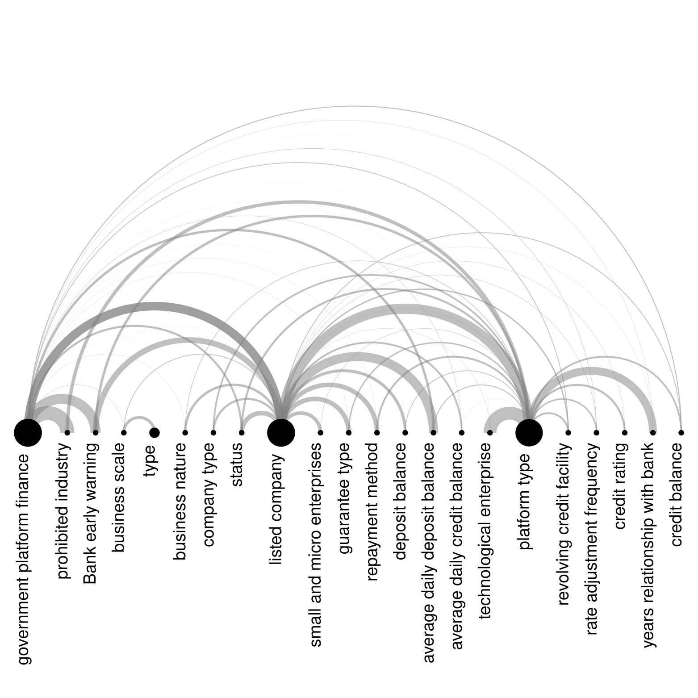
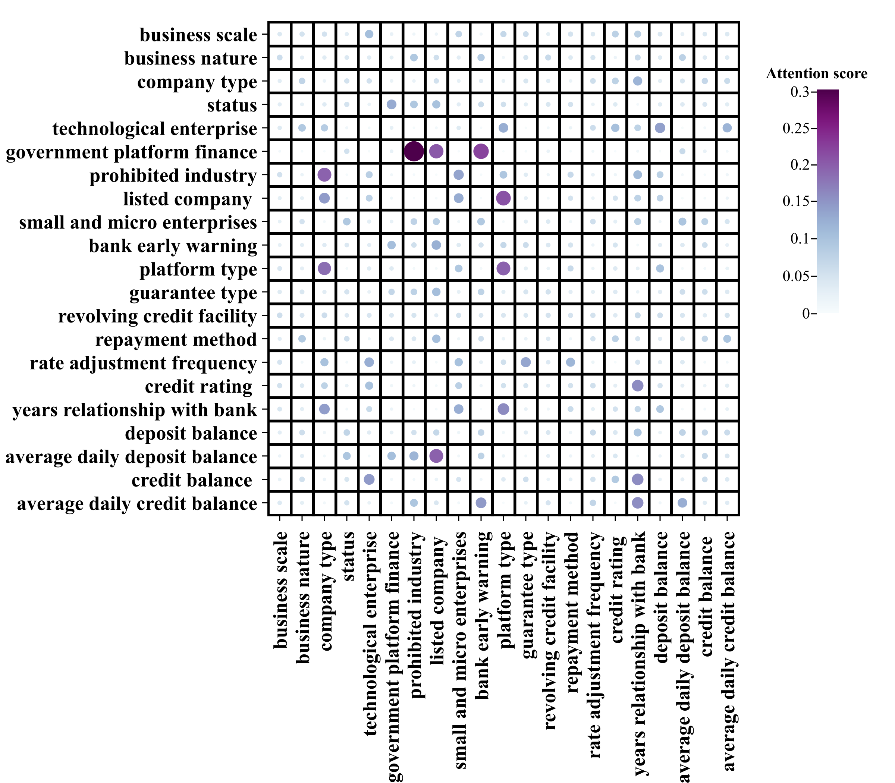
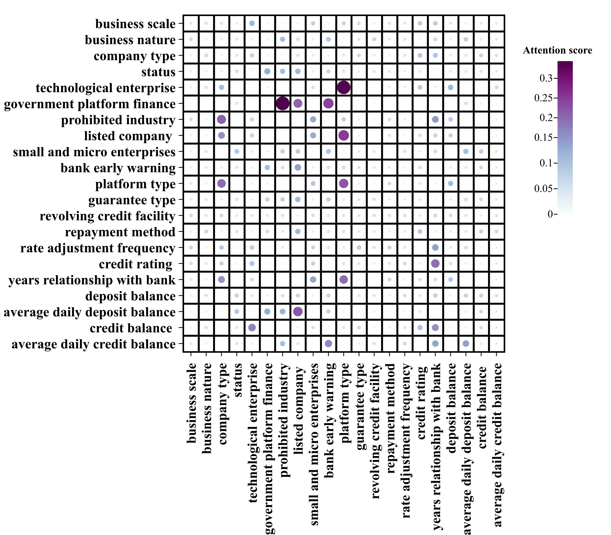
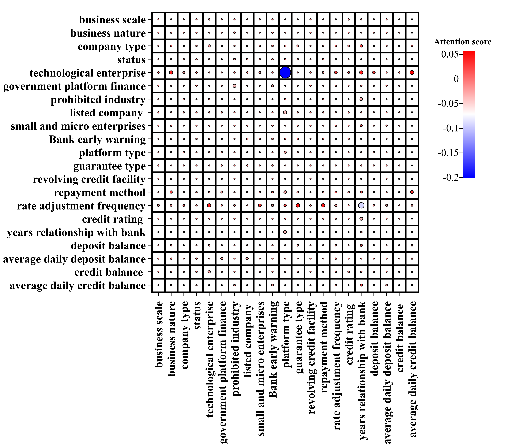
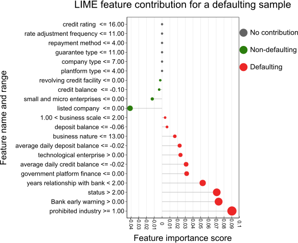
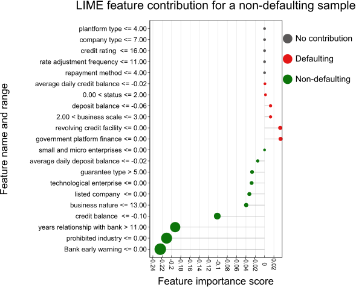
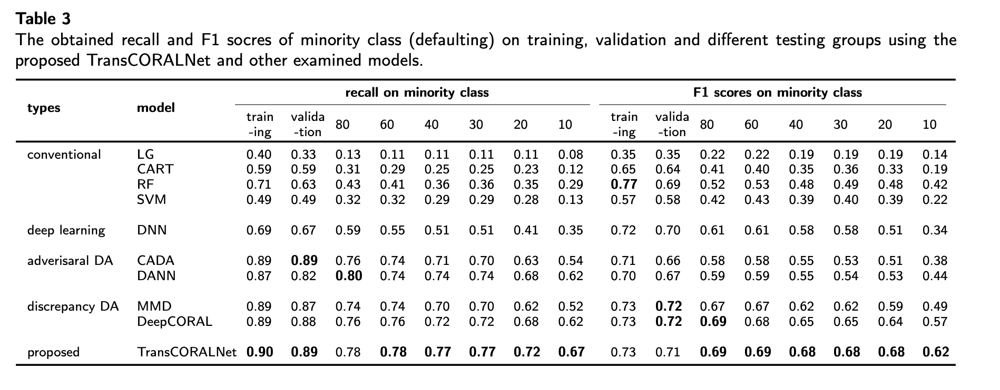
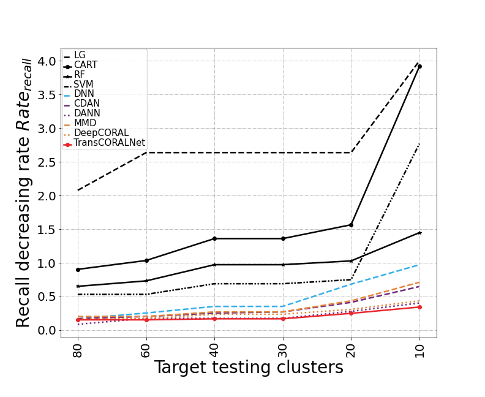
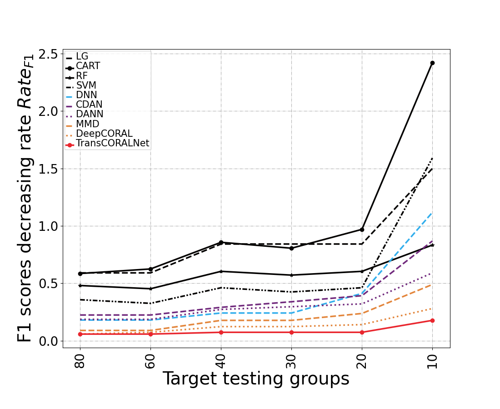

# TransCORALNet
## Architecture
Code for the Paper "TransCORALNet: A Two-Stream Transformer CORAL Networks for Supply Chain Credit Assessment Cold Start" 

[TransCORALNet]

The proposed TransCORALNet can be found in the model-folder under: 

**>>>IMPORTANT<<<**

The original Code from the paper can be found in this branch:[[TransCORALNet](https://github.com/JieJieNiu/TransCORALNet/tree/main/TransCORALNet)]


Also we provide the code of baseline models MMD and Deep CORAL:[[MMD and DeepCORAL](https://github.com/JieJieNiu/TransCORALNet/tree/main/MMD%20and%20DeepCORAL)]
CADA and DANN: [[CADA and DANN](https://github.com/JieJieNiu/TransCORALNet/tree/main/CADA%20and%20DANN)]


The trained model canbe download in this branch, you can load model-TransCORALNet.pt and use it directly, also the baseline models of CADA, DANN, MMD and DeepCORAL can be download here: 
[[Download trained models]( https://github.com/JieJieNiu/TransCORALNet/tree/main/Trained%20models)]

The current master branch has since upgraded packages and was refactored. Since the exact package-versions differ the experiments may not be 100% reproducible.

If you have problems running the code, feel free to open an issue here on Github.

---

## Installing dependencies
In any case a [requirements.txt](requirements.txt) is also added from the poetry export.
```
pip install -r requirements.txt
```

Basically, only the following requirements are needed:
```
numpy==1.20.3
opencv_python_headless==4.6.0.66
pandas==1.3.4
scikit_image==0.18.3
scikit_learn==1.2.0
scipy==1.7.1
torch==1.8.1
torchsummary==1.5.1
torchvision==0.9.1
lime==0.2.0.1
sdv
```
---

## Usages
### Generate synthetic data
First, use [CTGAN](https://github.com/JieJieNiu/TransCORALNet/tree/main/%20Synthetic%20target%20training%20and%20DataLoader) to generate synthetic data as target train data. Then use [dataloader] to prepare the training and testing dataset.


### Training
We offer several training/testing options as below:
For batchsize (--batchsize, default 256)
For training/testing epoch (--epoch, default 250)
TPU allocation 


example
For TransCORALNet training:
```
python TransCORALNet\train and test.py --batchsize 256 --epoch 250 --tpu
```
ForTransCORALNet prediction:
```
python TransCORALNet/prediction.py
```

### Explanation
You can use [[[Lime](https://github.com/JieJieNiu/TransCORALNet/tree/main/LIME)] to interpret the results of a model prediction. 
Also, the attention score calculation and visualization can be seen here: [Attention score](https://github.com/JieJieNiu/TransCORALNet/blob/main/TransCORALNet/Attention%20score%20results.py)


### Plot

Creating similar plots as in the paper: 
Using [rawgraphs](https://www.rawgraphs.io/) to create the following graph:

Attention score

Using [chiplot](https://www.chiplot.online/) to create the following Attention score graph:

positive 
negative 
difference

Using [chiplot](https://www.chiplot.online/) to create the following LIME explanation results:

defaulting 
non-defauling 

### Dataset
The dataset are not open access due to the current data protocal. If you are interested in the dataset that we used in this paper please write an e-mail to: s.mehrkanoon@uu.nl and j.shi1@uu.nl 

If you want to run this model on your own datasets, you can either

(1) reorganize your datasets: Step 1.normalized using a [Min-Max normalization](https://en.wikipedia.org/wiki/Feature_scaling#Rescaling_(min-max_normalization)). Step 2. run this code with your data to fit your project.

---


## Results
### Model performance

Recall_rate F1_rate

